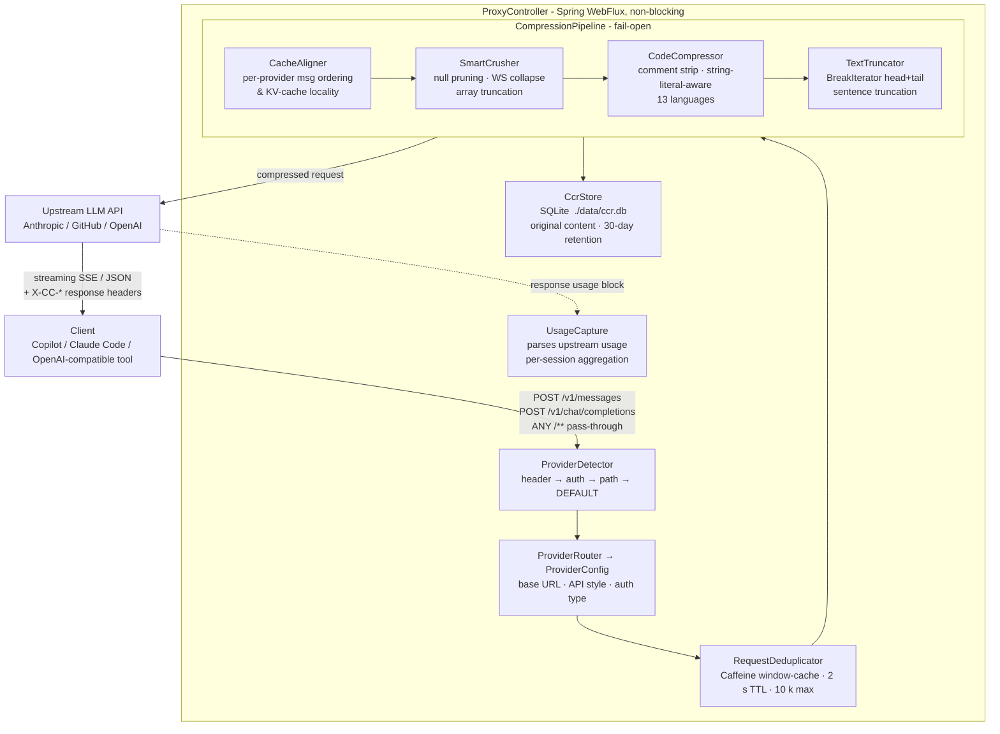

# ContextCompresso

> A VS Code extension that cuts your AI coding tool token costs - install it, point Copilot or Claude Code at it, done.

[](https://openjdk.org/)
[](https://code.visualstudio.com/)
[](./src/test)
[](LICENSE)

ContextCompresso is a VS Code extension for teams whose AI coding tools (GitHub Copilot, Claude Code) burn through token/credit budgets faster than expected. It runs a small local proxy for you, sits it between your tools and their LLM APIs, and shows you exactly where your tokens are going while it quietly strips out the low-signal content that was never worth paying for.

No cloud service, no telemetry leaving your machine, no changes to how you use Copilot or Claude Code day-to-day beyond a one-time config change the extension makes for you.

---

## Table of Contents

- [What It Does](#what-it-does)
- [Install](#install)
- [Using It](#using-it)
- [Extension Settings](#extension-settings)
- [Requirements](#requirements)
- [FAQ](#faq)
- [Building From Source](#building-from-source)
- [Reference: How The Proxy Works](#reference-how-the-proxy-works)
- [Contributing / Local Development](#contributing--local-development)
- [Testing](#testing)
- [Design Decisions Worth Noting](#design-decisions-worth-noting)

---

## What It Does

- **Runs a local proxy for you.** No terminal, no `java -jar`. The extension starts it when VS Code opens and stops it when VS Code closes.
- **Shows live cost signal in the status bar**: cache-hit percentage and effective token usage, updated every few seconds, with a trend arrow so a runaway session gets caught early instead of at the end of the day.
- **Gives you a dashboard** (click the status bar item) with cost drivers, an hourly usage trend, a per-model breakdown, and how much the compression pipeline is actually saving.
- **Compresses requests before they leave your machine**: strips redundant whitespace, dead JSON fields, code comments, and oversized tool output, then forwards the smaller request upstream and streams the response back unchanged. Typically invisible - the model never sees anything different.
- **Warns you when caching breaks.** Anthropic and OpenAI both bill cached tokens at a steep discount, but caching only works if your prompt prefix matches byte-for-byte between turns. If something breaks that (a client bug, an edited message), ContextCompresso flags it instead of leaving you to wonder why costs suddenly jumped.
- **Configures Copilot/Claude Code for you** with one click, instead of you hand-editing `settings.json` or shell profiles.

---

## Install

You'll be given a `.vsix` file (built from this repo - see [Building From Source](#building-from-source) if you need to produce one yourself). No Marketplace account or public listing involved.

**From the command line:**

```bash
code --install-extension contextcompresso-0.1.0.vsix
```

**From VS Code:**

1. Open the Extensions view (`Cmd/Ctrl+Shift+X`)
2. Click the `...` menu at the top → **Install from VSIX...**
3. Select the `.vsix` file

Reload VS Code if prompted. That's the entire install - the extension bundles the proxy jar itself, so you don't need Maven, and you don't need Node or Python on your machine either; VS Code runs the extension's JavaScript using its own built-in runtime.

**The only real requirement:** Java 17 or newer on your PATH (or set via `JAVA_HOME`, or pointed to explicitly in settings - see [Extension Settings](#extension-settings)). That's what the bundled proxy runs on.

---

## Using It

Once installed, ContextCompresso starts automatically and you'll see a status bar item appear at the bottom right:

```
✓ 94% cached · 106k eff
```

- The **check/warning/flame icon** reflects your cache hit rate at a glance (good / degraded / poor).
- **`94% cached`** - percentage of input tokens served from cache this session. This is the number that predicts whether your next request is cheap or expensive.
- **`106k eff`** - effective input tokens, weighted by what cache reads/writes actually cost vs. full-price input. This is the number that maps to your credit/usage bar.
- Click it (or run **ContextCompresso: Show Usage Dashboard** from the Command Palette) to open the full dashboard.

### Point your tools at it

Run these from the Command Palette (`Cmd/Ctrl+Shift+P`):

| Command | What it does |
|---|---|
| **ContextCompresso: Point GitHub Copilot at Proxy** | Sets `github.copilot.advanced.debug.overrideProxyUrl` to the local proxy |
| **ContextCompresso: Point Claude Code at Proxy** | Sets `claudeCode.environmentVariables` (`ANTHROPIC_BASE_URL`) so the Claude Code VS Code extension routes through the proxy |
| **ContextCompresso: Show Usage Dashboard** | Opens the dashboard webview |
| **ContextCompresso: Restart Proxy** | Restarts the bundled proxy process |
| **ContextCompresso: Open Proxy Logs** | Opens the proxy's log output |

The extension also prompts you to run one of these automatically the first time the proxy starts, so you shouldn't need to hunt for them in the Command Palette on a fresh install.

Run the one for whichever tool you use and you're done - your API keys and auth headers are forwarded upstream unchanged, so nothing else about how you use the tool changes. Takes effect on the next request; no VS Code restart needed. If you run the Claude Code **CLI** outside VS Code (not the VS Code extension), that setting doesn't reach it - export `ANTHROPIC_BASE_URL` in your shell instead (the command offers to copy this for you).

---

## Extension Settings

| Setting | Default | Description |
|---|---|---|
| `contextcompresso.jarPath` | *(empty)* | Path to `contextcompresso.jar`. Leave empty to use the jar bundled with the extension. |
| `contextcompresso.port` | `8137` | Port the local proxy listens on. |
| `contextcompresso.autoStart` | `true` | Start the proxy automatically when VS Code opens. |
| `contextcompresso.javaPath` | *(empty)* | Path to a Java 17+ executable. Leave empty to auto-detect (`JAVA_HOME`, then `PATH`). |

---

## Requirements

- **Java 17+** - to run the bundled proxy. Nothing else to install.
- **VS Code 1.85+**

You do **not** need Maven, Node.js, or Python to install or run the extension - those are only needed if you're building it from source (see below).

---

## FAQ

**Does this send my code anywhere?** No. The proxy runs entirely on your machine and only forwards requests to the same upstream (Anthropic/GitHub/OpenAI) your tool was already talking to. Nothing goes to a ContextCompresso server, because there isn't one.

**Will my API key be affected?** No. Auth headers pass through unchanged; the proxy never inspects or stores your key.

**Why is the cache-hit percentage low / red?** It means your prompt prefix changed between turns - often from editing an earlier message, or a client that doesn't resend history byte-for-byte. Cached tokens are ~10x cheaper than fresh ones, so a broken cache is usually the single biggest cost driver in a session. Check the dashboard's "cost drivers" section.

**Can I use this without the VS Code extension?** Yes - the extension is a convenience wrapper around a standalone Java proxy. See [Building From Source](#building-from-source) and [Reference: How The Proxy Works](#reference-how-the-proxy-works) if you want to run it directly, e.g. for a non-VS-Code editor.

**Where's the data stored?** Locally in a SQLite file the proxy manages on its own; nothing is synced anywhere.

---

## Building From Source

Needed only if you're producing the `.vsix` yourself rather than installing a pre-built one. This step does need Node.js (to compile the extension's TypeScript) and Maven (to build the proxy jar) - but only on the machine doing the build, never on a machine installing the result.

```bash
git clone <repo-url>
cd ContextCompresso/vscode-extension
npm install -g @vscode/vsce   # one-time
./build.sh
```

This builds `contextcompresso.jar` from the Maven project, copies it into `resources/` so it ships inside the extension, compiles the TypeScript, and packages `contextcompresso-0.1.0.vsix` in the same directory.

**Iterating on the extension itself:** open `vscode-extension/` in VS Code and press `F5` to launch an Extension Development Host with your changes loaded live - no `.vsix` packaging needed while you're actively working on it.

See [`vscode-extension/README.md`](vscode-extension/README.md) for the extension's internal source layout.

---

## Reference: How The Proxy Works

This section is for anyone extending the proxy, running it standalone outside VS Code, or just curious what's actually happening to their requests. None of it is necessary reading to use the extension.

### Architecture



Streaming SSE or JSON chunks are piped directly back to the client without buffering. Response headers (`X-CC-Original-Chars`, `X-CC-Compressed-Chars`, `X-CC-Ratio`, `X-CC-Request-Id`) are injected before the client sees the response. Any path other than `/v1/messages` and `/v1/chat/completions` is forwarded as a raw byte stream with no compression or storage - useful for keep-alive pings, token-count endpoints, etc.

### Feature list

| Feature | Details |
|---|---|
| Multi-provider routing | Detects Copilot vs. Claude vs. generic OpenAI-compatible from auth headers, path, and request shape |
| Provider override header | `X-CC-Provider: CLAUDE` / `COPILOT` / `DEFAULT` bypasses all heuristics |
| Four-stage compression pipeline | Cache alignment → structural cleanup → code comment stripping → sentence-boundary truncation |
| Tool-result compaction | Line-based head+tail truncation for oversized `tool_result` blocks specifically |
| Cache-prefix divergence detection | Flags when a session's cached prompt prefix changes between turns |
| Usage telemetry + stats API | Captures `usage` data from upstream responses and aggregates it per session/hour/model |
| Fail-open safety | Any exception anywhere in the pipeline falls back to forwarding the original, unmodified request |
| String-literal-aware comment stripping | Handles `//`, `/* */`, `#` across 13 languages without corrupting string literals |
| Compressed Content Registry (CCR) | Every original pre-compression message is stored in SQLite and retrievable, auto-purged after 30 days |
| Request deduplication | Caffeine window-cache short-circuits duplicate payloads within a 2-second window |
| SSE streaming passthrough | No buffering of streamed responses |
| Micrometer metrics | Counters/timers for requests, compression ratio, chars/tokens saved, upstream duration, dedup hits |

### Tech stack

| Layer | Technology | Notes |
|-------|-----------|-------|
| Language | Java 17 | Records, sealed types, text blocks |
| Framework | Spring Boot 3.2.5 + WebFlux | Fully reactive/non-blocking request path |
| HTTP Client | Spring WebClient (Reactor Netty) | Streaming-safe; no response body buffering |
| Database | SQLite via `xerial/sqlite-jdbc 3.45.3.0` | WAL mode + NORMAL sync; single-table append-mostly local store; no ORM overhead |
| JSON | Jackson `ObjectNode` pipeline | Operates on `JsonNode` trees - generic and resilient to unknown fields |
| Tokenizer | jtokkit `CL100K_BASE` | Exact GPT-family token counts for Copilot; calibrated char-ratio heuristic for Claude |
| Caching | Caffeine | Deduplication window cache, bounded to 10,000 entries |
| Metrics | Micrometer + Spring Actuator | Exposed at `/actuator/metrics` |

### Component reference

| Component | Role |
|---|---|
| `ProxyController` | Three endpoints: `/v1/messages` (Claude), `/v1/chat/completions` (Copilot/OpenAI), `/**` catch-all passthrough. 60s upstream timeout; fail-open |
| `ProviderDetector` | Detection priority: `X-CC-Provider` header → auth-header heuristics → path → DEFAULT |
| `ProviderRouter` | Maps detection result to a `ProviderConfig` record (base URL, API style, auth type, token budget, estimator) |
| `CompressionPipeline` | Orchestrates the four stages; fail-open wrapper; records Micrometer metrics |
| `CacheAligner` | Provider-aware message ordering for KV-cache/prompt-cache locality |
| `SmartCrusher` | Null/empty field pruning, whitespace collapsing, array head+tail truncation |
| `CodeCompressor` | String-literal-aware comment/blank-line stripping for 13 languages; aggressive mode strips imports |
| `TextTruncator` | `BreakIterator`-based head+tail sentence truncation for oversized text blocks |
| `ToolResultCompactor` | Line-based head+tail truncation for oversized `tool_result` blocks (tool output is naturally line-delimited, unlike prose) |
| `RequestDeduplicator` | Caffeine window-cache (2s TTL, max 10,000 entries) short-circuits SHA-256-matched duplicate requests |
| `CcrStore` | `JdbcTemplate`-backed SQLite repository; SHA-256 keyed entries; `INSERT OR REPLACE` semantics |
| `CcrController` | `GET /ccr/{id}` and `GET /ccr/request/{requestId}` - original content retrieval |
| `CcrPurgeScheduler` | Nightly purge of entries beyond retention window |
| `JtokkitEstimator` | Exact GPT token counts via jtokkit `CL100K_BASE` - used for Copilot |
| `AnthropicEstimator` | Calibrated heuristic (`chars/3.2` prose, `chars/2.5` code) - used for Claude |
| `UsageCapture` / `UsageExtractor` / `UsageStore` | Taps response bodies (including SSE) for `usage` data, parses it, persists per-session records |
| `SessionKeyResolver` | Derives a stable session key from `system` + the first message, so it survives conversation growth |
| `CachePrefixMonitor` | Compares the overlapping message range across turns to detect prompt-prefix divergence |
| `StatsService` / `StatsController` | Aggregates `UsageRecord`s into live/today/top-cost views, exposed at `/stats/*` |

### Proxy configuration reference

All settings live in `src/main/resources/application.yml` under `contextcompresso.*`, overridable via `-Dcontextcompresso.some.property=value` or the equivalent environment variable.

| Property | Default | Description |
|---|---|---|
| `server.port` | `8137` | Port the proxy listens on |
| `contextcompresso.providers.copilot.base-url` | `https://api.githubcopilot.com` | Copilot upstream |
| `contextcompresso.providers.claude.base-url` | `https://api.anthropic.com` | Claude upstream |
| `contextcompresso.providers.default.base-url` | `https://api.openai.com` | Fallback for any OpenAI-compatible endpoint |
| `contextcompresso.compression.enabled` | `true` | Master switch for the pipeline |
| `contextcompresso.compression.min-compress-chars` | `200` | Requests smaller than this pass through untouched |
| `contextcompresso.compression.tool-result-compaction-enabled` | `true` | Head/tail line compaction of oversized `tool_result` blocks |
| `contextcompresso.compression.max-tool-result-chars` | `2000` | Threshold above which a `tool_result` block is compacted |
| `contextcompresso.ccr.enabled` | `true` | Store originals in SQLite for retrieval |
| `contextcompresso.ccr.db-path` | `./data/ccr.db` | SQLite database path |
| `contextcompresso.ccr.retention-days` | `30` | Originals older than this are purged nightly at 2am |
| `contextcompresso.usage.cache-read-weight` | `0.1` | Weight applied to `cache_read_input_tokens` when computing effective cost |
| `contextcompresso.usage.cache-write-weight` | `1.25` | Weight applied to `cache_creation_input_tokens` when computing effective cost |
| `contextcompresso.usage.retention-days` | `30` | Usage records older than this are purged nightly at 2:15am |

See [`docs/PLAN-v1.md`](docs/PLAN-v1.md) for the original architecture reference and [`docs/PLAN-v2-dashboard.md`](docs/PLAN-v2-dashboard.md) for the usage-telemetry/dashboard design.

### Running the proxy standalone (without the extension)

```bash
mvn clean package
java -jar target/contextcompresso.jar
curl http://localhost:8137/actuator/health   # {"status":"UP"}
```

Point a client at it the same way the extension's commands do:

```bash
export ANTHROPIC_BASE_URL=http://localhost:8137          # Claude Code
```
```json
{ "github.copilot.advanced": { "debug.overrideProxyUrl": "http://localhost:8137" } }
```

Every proxied response carries `X-CC-Original-Chars`, `X-CC-Compressed-Chars`, `X-CC-Ratio`, and `X-CC-Request-Id` headers; the latter retrieves the pre-compression original via `GET /ccr/request/{id}`. Usage aggregates are available at `/stats/live`, `/stats/session/{key}`, `/stats/today`, and `/stats/top-costs`. Custom Micrometer metrics (`cc.tokens.saved`, `cc.chars.saved`, `cc.compression.ratio`, `cc.dedup.hits`, `cc.cache.prefix.diverged`, etc.) are under `/actuator/metrics`.

---

## Contributing / Local Development

```bash
mvn spring-boot:run              # run without building a fat jar
mvn test                         # run the Java test suite
mvn test -Dtest=CodeCompressorTest   # a single test class
```

Create `src/main/resources/application-local.yml` (gitignored) for local overrides, then run with `--spring.profiles.active=local`. The project includes `spring-boot-configuration-processor`, so IntelliJ and VS Code (with Spring Boot Tools) auto-complete `contextcompresso.*` properties.

For the extension itself, see [Building From Source](#building-from-source) above.

---

## Testing

```bash
mvn test
```

85 tests across 20 classes covering provider detection, each compression stage in isolation (including tool-result compaction), token estimators, CCR storage, usage extraction/session-keying/cache-prefix detection, stats aggregation, and full end-to-end proxy behavior via `MockWebServer` for Copilot-, Claude-, and generic-style requests - including that upstream receives a smaller body, fail-open holds when compression or usage capture is skipped, and CCR entries are correctly written.

---

## Design Decisions Worth Noting

**Fail-open as a hard constraint.** The entire compression pipeline is wrapped in a single try/catch. A compression bug silently falls back to forwarding the original body - a proxy that blocks calls is worse than a proxy that doesn't compress.

**Session keys hash only the system prompt and first message.** A stateless proxy has no session concept to draw on, so `SessionKeyResolver` derives one from `system` + `messages[0]` only, since later message indices aren't stable across turns (index 1 is empty on turn 1, but holds the assistant's reply by turn 2). `CachePrefixMonitor` faces the same problem and solves it the same way: it compares only the message range that overlaps between two consecutive requests, so ordinary conversation growth is never mistaken for a cache-prefix divergence.

**Tool-result compaction splits on lines, not sentences.** `TextTruncator`'s `BreakIterator`-based sentence splitting requires an uppercase letter after `". "` to register a boundary, which fails silently on tool output shaped like `"file.java:12: match. src/other.java:8: ..."` - a lowercase continuation collapses the whole block into one unsplittable "sentence." `ToolResultCompactor` sidesteps this by splitting on `\n` instead, which is both correct and simpler for content that's naturally line-delimited (grep dumps, stack traces, command output).

**SQLite with plain `JdbcTemplate`, no JPA.** The CCR is a single-table append-mostly local store; ORM overhead adds nothing here.

**`AnthropicEstimator` uses a content-aware char ratio.** Token estimation for Claude uses `chars/3.2` for prose and `chars/2.5` for code, switching based on a scan of the first 2,000 characters for structural tokens (`{`, `}`, `;`, `function`, `def `, etc.).

---

## License

[Apache 2.0](LICENSE)
