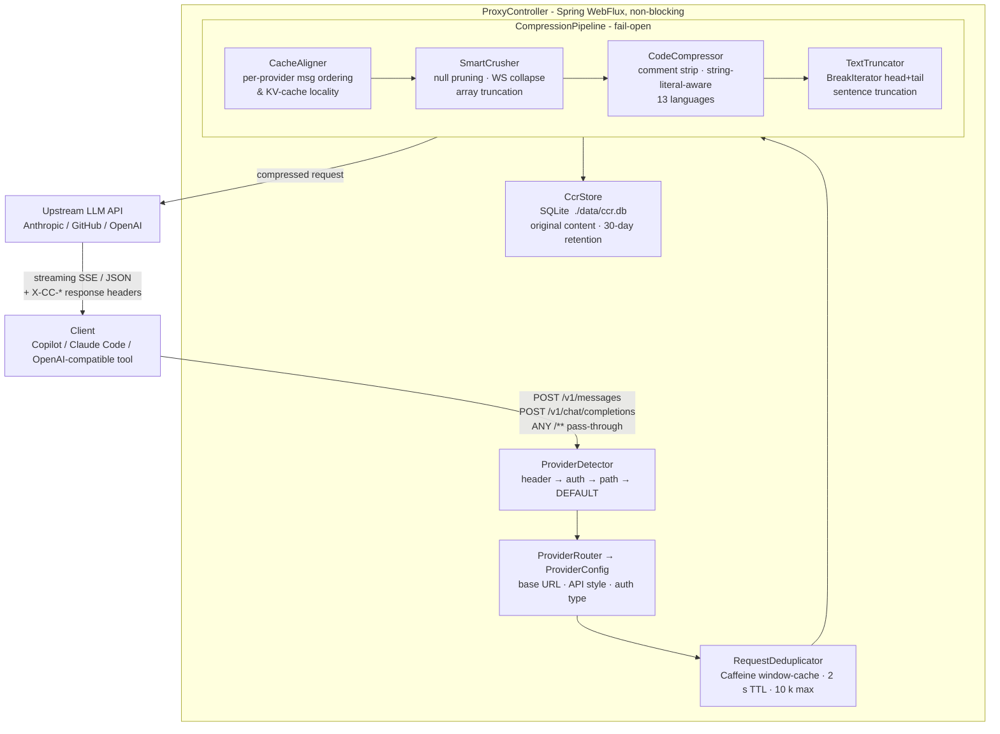

# ContextCompresso

> A locally-running, reactive Java proxy that cuts your AI coding tool token costs - transparently, with zero IDE changes.

[](https://openjdk.org/)
[](https://spring.io/projects/spring-boot)
[](https://maven.apache.org/)
[](./src/test)
[](LICENSE)

ContextCompresso sits between your AI coding tools (GitHub Copilot, Claude Code) and their LLM APIs. It intercepts outgoing chat/completion payloads, runs them through a multi-stage compression pipeline, stores the originals for later retrieval, and forwards the smaller request upstream - then streams the response back unchanged. The only configuration change you make is a single `base-url` override in your shell or workspace settings.

---

## Table of Contents

- [Why This Exists](#why-this-exists)
- [Architecture](#architecture)
- [Feature Highlights](#feature-highlights)
- [Tech Stack](#tech-stack)
- [Requirements](#requirements)
- [Getting Started](#getting-started)
- [Configuration](#configuration)
- [Local Development](#local-development)
- [Component Reference](#component-reference)
- [Compression Pipeline Deep Dive](#compression-pipeline-deep-dive)
- [Provider Routing](#provider-routing)
- [Response Headers](#response-headers)
- [Error Responses](#error-responses)
- [CCR API](#ccr-api)
- [Metrics](#metrics)
- [Usage Stats API](#usage-stats-api)
- [VS Code Extension](#vs-code-extension)
- [Testing](#testing)
- [Design Decisions Worth Noting](#design-decisions-worth-noting)

---

## Why This Exists

LLM APIs bill by token. In long coding sessions, a significant chunk of every request is low-signal content: redundant whitespace, verbose code comments, import blocks, overly long tool outputs, and repeated structural boilerplate. ContextCompresso strips that noise before the request leaves your machine - savings show up immediately in the `X-CC-Ratio` response header and in the `/actuator/metrics` dashboard.

---

## Architecture



**Response path**: streaming SSE or JSON chunks are piped directly back to the client without buffering. Response headers `X-CC-Original-Chars`, `X-CC-Compressed-Chars`, `X-CC-Ratio`, and `X-CC-Request-Id` are injected before the client sees the response.

**Catch-all pass-through**: any path other than `/v1/messages` and `/v1/chat/completions` is forwarded to the DEFAULT provider's base URL as a raw byte stream - no compression, no CCR storage. Useful for keep-alive pings, token-count endpoints, etc.

---

## Feature Highlights

| # | Feature | Details |
|---|---------|---------|
| 1 | **Multi-provider routing** | Detects Copilot vs. Claude vs. generic OpenAI-compatible automatically from auth headers, path, and request shape - no manual switch needed |
| 2 | **Provider override header** | Send `X-CC-Provider: CLAUDE`, `COPILOT`, or `DEFAULT` to bypass all heuristics and force a specific upstream |
| 3 | **Four-stage compression pipeline** | Cache alignment → structural cleanup → code comment stripping → sentence-boundary truncation |
| 4 | **Fail-open safety** | Any exception in the pipeline falls back to forwarding the original unmodified body - the proxy never blocks a request |
| 5 | **String-literal-aware comment stripping** | Handles `//`, `/* */`, and `#` comments across 13 languages; correctly ignores `//` inside quoted strings and escaped characters |
| 6 | **BreakIterator sentence truncation** | Truncates oversized text with head+tail sentence boundaries, never mid-word or mid-sentence |
| 7 | **Provider-specific cache alignment** | Claude: pure no-op (preserves Anthropic prompt-cache prefix); Copilot: locks injected system prompts in place; OpenAI default: sorts by SHA-256 content hash for KV-cache locality |
| 8 | **Compressed Content Registry (CCR)** | Every original pre-compression message is stored in SQLite and retrievable via `GET /ccr/request/{id}`. Auto-purged after 30 days |
| 9 | **Request deduplication** | Caffeine window-cache short-circuits duplicate payloads within a 2-second window - prevents double-billing from rapid keystrokes or IDE retries |
| 10 | **SSE streaming passthrough** | Detects `"stream": true` and pipes upstream event-stream chunks directly without buffering |
| 11 | **Micrometer metrics** | Custom counters and timers for requests, compression ratio, chars/tokens saved, upstream duration, skipped compressions, and dedup hits |
| 12 | **Tool-result compaction** | Line-based head+tail truncation for oversized `tool_result` blocks, independent of the general text truncator |
| 13 | **Cache-prefix divergence detection** | Warns and increments a metric when a session's cached prompt prefix changes between turns, converting cheap cache reads back into full-price input tokens |
| 14 | **Usage telemetry + stats API** | Captures `usage` data from upstream responses (streamed and non-streamed) and aggregates it per session, hour, and model via `/stats/*` |
| 15 | **VS Code extension** | Runs the proxy for you and shows live cache-hit rate and effective token usage in the status bar and a dashboard webview |

---

## Tech Stack

| Layer | Technology | Notes |
|-------|-----------|-------|
| Language | Java 17 | Records, sealed types, text blocks |
| Framework | Spring Boot 3.2.5 + WebFlux | Fully reactive/non-blocking request path |
| HTTP Client | Spring WebClient (Reactor Netty) | Streaming-safe; no response body buffering |
| Database | SQLite via `xerial/sqlite-jdbc 3.45.3.0` | WAL mode + NORMAL sync; single-table append-mostly local store; no ORM overhead |
| JSON | Jackson `ObjectNode` pipeline | Operates on `JsonNode` trees - generic and resilient to unknown fields |
| Tokenizer | jtokkit `CL100K_BASE` | Exact GPT-family token counts for Copilot; calibrated char-ratio heuristic for Claude |
| Caching | Caffeine | Deduplication window cache, bounded to 10,000 entries |
| Metrics | Micrometer + Spring Actuator | Exposed at `/actuator/metrics` |
| Testing | JUnit 5, `reactor-test`, OkHttp `MockWebServer` | 85 tests; E2E proxy tests assert upstream body is smaller |

---

It also captures usage/cache telemetry from upstream responses and exposes it via a stats API, with an optional VS Code extension (`vscode-extension/`) that runs the proxy for you and surfaces live token/cache stats in a status bar item and dashboard.

## Requirements

- Java 17+
- Maven 3.8+

---

## Getting Started

### Quick setup (recommended)

After cloning, run the setup script for your OS. It builds the jar, starts it, waits for a passing health check, and prints the exact config snippet for your chosen client:

```bash
# macOS / Linux
git clone <repo-url>
cd ContextCompresso
./scripts/setup.sh
```

```bat
:: Windows
git clone <repo-url>
cd ContextCompresso
scripts\setup.bat
```

You'll be prompted to choose **Claude Code** or **GitHub Copilot**, then the script prints the environment variable or VS Code `settings.json` snippet. Skip ahead to [step 5](#5-verify-savings) to try it out.

**macOS note**: if the setup script warns about a stub Java launcher, run the Homebrew JDK fix it prints, which looks like:
```bash
sudo ln -sfn /opt/homebrew/opt/openjdk@17/libexec/openjdk.jdk /Library/Java/JavaVirtualMachines/openjdk-17.jdk
```

---

### Manual setup

#### 1. Clone and build

```bash
git clone <repo-url>
cd ContextCompresso
mvn clean package
```

#### 2. Run it

```bash
# defaults to port 8137 (chosen to avoid common dev ports like 8080/3000)
# first run auto-creates ./data/ccr.db
java -jar target/contextcompresso.jar

# override port if 8137 is taken
java -jar target/contextcompresso.jar --server.port=9137
```

#### 3. Verify it's alive

```bash
curl http://localhost:8137/actuator/health
# {"status":"UP"}
```

#### 4. Point your client at it

**Claude Code** (VS Code extension or CLI) reads `ANTHROPIC_BASE_URL` from its environment:

```bash
# Shell profile (~/.zshrc, ~/.bashrc) - applies to all sessions
export ANTHROPIC_BASE_URL=http://localhost:8137
```

Or, scoped to a single VS Code workspace:

```json
{
  "terminal.integrated.env.windows": {
    "ANTHROPIC_BASE_URL": "http://localhost:8137"
  }
}
```

(Use `terminal.integrated.env.osx` / `.linux` on those platforms. Auth headers are forwarded upstream unchanged - the proxy never touches your API key.)

**GitHub Copilot**:

```json
{
  "github.copilot.advanced": {
    "debug.overrideProxyUrl": "http://localhost:8137"
  }
}
```

#### 5. Verify savings

Trigger any Claude Code prompt in VS Code or `curl` `/v1/messages` directly:

```bash
curl -sD - http://localhost:8137/v1/messages \
  -H "x-api-key: $ANTHROPIC_API_KEY" \
  -H "anthropic-version: 2023-06-01" \
  -H "content-type: application/json" \
  -d '{"model":"claude-sonnet-5","max_tokens":100,"messages":[{"role":"user","content":"say hi"}]}' \
  -o /dev/null
```

Look for these response headers on any real (larger) request:

```
X-CC-Original-Chars:    4213
X-CC-Compressed-Chars:  2870
X-CC-Ratio:             0.68
X-CC-Request-Id:        3f9e2c1a-...
```

**Cumulative session metrics:**

```bash
curl -s http://localhost:8137/actuator/metrics/cc.tokens.saved   | jq
curl -s http://localhost:8137/actuator/metrics/cc.chars.saved    | jq
curl -s http://localhost:8137/actuator/metrics/cc.compression.ratio | jq
```

**Retrieve the original pre-compression payload for any request:**

```bash
curl http://localhost:8137/ccr/request/<request-id>
```

#### 6. Stop the proxy

```bash
# If started via setup.sh - PID is saved to contextcompresso.pid
kill $(cat contextcompresso.pid)

# Or find it directly
pkill -f contextcompresso.jar       # macOS / Linux
taskkill /F /IM java.exe            # Windows (kills all JVMs - use with care)
```

---

## Configuration

All settings live in `src/main/resources/application.yml` under `contextcompresso.*`, and can be overridden at startup with `-Dcontextcompresso.some.property=value` (JVM system property) or the equivalent `CONTEXTCOMPRESSO_SOME_PROPERTY=value` environment variable.

| Property | Default | Description |
|---|---|---|
| `server.port` | `8137` | Port the proxy listens on |
| `contextcompresso.providers.copilot.base-url` | `https://api.githubcopilot.com` | Copilot upstream |
| `contextcompresso.providers.copilot.strip-copilot-system-prompts` | `false` | Strip Copilot-injected system prompts before forwarding (experimental) |
| `contextcompresso.providers.claude.base-url` | `https://api.anthropic.com` | Claude upstream |
| `contextcompresso.providers.claude.cache-alignment-enabled` | `true` | Enable/disable cache alignment for Claude |
| `contextcompresso.providers.claude.preserve-cache-control-blocks` | `true` | Preserve `cache_control` blocks in Claude messages |
| `contextcompresso.providers.default.base-url` | `https://api.openai.com` | Fallback for any OpenAI-compatible endpoint |
| `contextcompresso.compression.enabled` | `true` | Master switch for the pipeline |
| `contextcompresso.compression.min-compress-chars` | `200` | Requests smaller than this pass through untouched |
| `contextcompresso.compression.truncation-head-sentences` | `5` | Sentences kept from the head when text is truncated |
| `contextcompresso.compression.truncation-tail-sentences` | `3` | Sentences kept from the tail when text is truncated |
| `contextcompresso.ccr.enabled` | `true` | Store originals in SQLite for retrieval |
| `contextcompresso.ccr.db-path` | `./data/ccr.db` | SQLite database path |
| `contextcompresso.ccr.retention-days` | `30` | Originals older than this are purged nightly at 2am |
| `contextcompresso.ccr.min-original-chars` | `200` | Minimum character count for a message to be stored in CCR |
| `contextcompresso.usage.cache-read-weight` | `0.1` | Weight applied to `cache_read_input_tokens` when computing effective cost |
| `contextcompresso.usage.cache-write-weight` | `1.25` | Weight applied to `cache_creation_input_tokens` when computing effective cost |
| `contextcompresso.usage.retention-days` | `30` | Usage records older than this are purged nightly at 2:15am |
| `contextcompresso.compression.tool-result-compaction-enabled` | `true` | Head/tail line compaction of oversized `tool_result` blocks |
| `contextcompresso.compression.max-tool-result-chars` | `2000` | Threshold above which a `tool_result` block is compacted |
| `logging.level.com.contextcompresso` | `INFO` | Log verbosity for all proxy components |

See [`docs/PLAN-v1.md`](docs/PLAN-v1.md) for the original architecture reference and [`docs/PLAN-v2-dashboard.md`](docs/PLAN-v2-dashboard.md) for the usage-telemetry/dashboard design.

**Common runtime overrides:**

```bash
# Redirect all Claude traffic to a different proxy
java -jar contextcompresso.jar -Dcontextcompresso.providers.claude.base-url=http://my-proxy

# Store the SQLite database on a different disk
java -jar contextcompresso.jar -Dcontextcompresso.ccr.db-path=/mnt/fast/ccr.db

# Disable compression entirely (proxy becomes a pure passthrough)
java -jar contextcompresso.jar -Dcontextcompresso.compression.enabled=false

# Enable debug logging for the proxy
java -jar contextcompresso.jar -Dlogging.level.com.contextcompresso=DEBUG
```

---

## Local Development

### Run without building a fat jar

```bash
mvn spring-boot:run
```

### Local config overrides

Create `src/main/resources/application-local.yml` (gitignored) for settings you don't want committed:

```yaml
contextcompresso:
  providers:
    claude:
      base-url: http://localhost:9000   # point at a local mock
  ccr:
    db-path: /tmp/ccr-dev.db
logging:
  level:
    com.contextcompresso: DEBUG
```

Activate it:

```bash
java -jar target/contextcompresso.jar --spring.profiles.active=local
# or
mvn spring-boot:run -Dspring-boot.run.profiles=local
```

### IDE setup

The project includes the `spring-boot-configuration-processor` dependency, so IntelliJ and VS Code (with the Spring Boot Tools extension) auto-complete `contextcompresso.*` properties in `application.yml` and flag unknown keys.

No additional IDE configuration is required. IntelliJ users: import as a Maven project; the `.idea/` directory is gitignored.

### Run only tests

```bash
mvn test

# Single test class
mvn test -Dtest=CodeCompressorTest

# Single test method
mvn test -Dtest=EndToEndProxyTest#compressedBodyIsSmallerThanOriginal
```

### Debug logging

```bash
java -jar target/contextcompresso.jar -Dlogging.level.com.contextcompresso=DEBUG
```

Or add to your local `application-local.yml`:

```yaml
logging:
  level:
    com.contextcompresso: DEBUG
    org.springframework.web.reactive: DEBUG   # also log WebFlux internals
```

### Runtime data files

| File | Created by | Notes |
|---|---|---|
| `data/ccr.db` | First startup | SQLite WAL mode; `ccr.db-shm` and `ccr.db-wal` sidecars are normal |
| `contextcompresso.pid` | `setup.sh` | Not created on Windows; not created by `mvn spring-boot:run` |
| `contextcompresso.log` | `setup.sh` / `setup.bat` | `nohup` redirect; not a rolling appender |

> **Docker**: no `Dockerfile` or `docker-compose.yml` is included. The proxy is designed as a local sidecar and runs best natively.

---

## Component Reference

| Component | Role |
|---|---|
| `ProxyController` | Three endpoints: `/v1/messages` (Claude), `/v1/chat/completions` (Copilot/OpenAI), `/**` catch-all passthrough. 60s upstream timeout; fail-open |
| `ProviderDetector` | Detection priority: `X-CC-Provider` header → auth-header heuristics → path → DEFAULT |
| `ProviderRouter` | Maps detection result to a `ProviderConfig` record (base URL, API style, auth type, token budget, estimator) |
| `CompressionPipeline` | Orchestrates the four stages; fail-open wrapper; records Micrometer metrics |
| `CacheAligner` | Provider-aware message ordering for KV-cache/prompt-cache locality |
| `SmartCrusher` | Null/empty field pruning, whitespace collapsing, array head+tail truncation with `[...truncated N elements...]` placeholder |
| `CodeCompressor` | String-literal-aware comment/blank-line stripping for 13 languages; aggressive mode strips imports |
| `TextTruncator` | `BreakIterator`-based head+tail sentence truncation for oversized text blocks |
| `ToolResultCompactor` | Line-based head+tail truncation for oversized `tool_result` blocks specifically (tool output is naturally line-delimited, unlike prose) |
| `RequestDeduplicator` | Caffeine window-cache (2s TTL, max 10,000 entries) short-circuits SHA-256-matched duplicate requests |
| `CcrStore` | `JdbcTemplate`-backed SQLite repository; SHA-256 keyed entries; `INSERT OR REPLACE` semantics |
| `CcrController` | `GET /ccr/{id}` and `GET /ccr/request/{requestId}` - original content retrieval |
| `CcrPurgeScheduler` | `@Scheduled(cron = "0 0 2 * * *")` nightly purge of entries beyond retention window |
| `JtokkitEstimator` | Exact GPT token counts via jtokkit `CL100K_BASE` - used for Copilot |
| `AnthropicEstimator` | Calibrated heuristic (`chars/3.2` prose, `chars/2.5` code) - used for Claude |
| `CcrDataDirectoryInitializer` | `ApplicationEnvironmentPreparedEvent` listener that `mkdirs()` the SQLite parent before the DataSource bean wires up |
| `UsageCapture` / `UsageExtractor` / `UsageStore` | Taps response bodies (including SSE) for `usage` data, parses it, persists per-session records |
| `SessionKeyResolver` | Derives a stable session key from `system` + the first message, so it survives conversation growth |
| `CachePrefixMonitor` | Compares the overlapping message range across turns to detect prompt-prefix divergence |
| `StatsService` / `StatsController` | Aggregates `UsageRecord`s into live/today/top-cost views, exposed at `/stats/*` |

---

## Compression Pipeline Deep Dive

### Stage 1 - CacheAligner

Reorders messages to maximise KV-cache / prompt-cache locality before sending upstream. Behaviour differs by provider:

| Provider | Behaviour |
|---|---|
| **CLAUDE** | No-op. Message order is frozen exactly as received to preserve Anthropic's prefix-cache hit window. |
| **COPILOT** | The leading run of Copilot-injected system messages is locked in place. Any user-added system messages that follow are hoisted and sorted by SHA-256 content hash for determinism. |
| **DEFAULT / OpenAI** | All system messages are hoisted to the front of the message list and sorted by SHA-256 content hash for maximum KV-cache locality. |

### Stage 2 - SmartCrusher

Structural cleanup on the JSON tree:
- Removes `null` and empty-string fields
- Collapses consecutive whitespace (spaces and newlines) within string values
- Deduplicates array elements that have the same JSON key (last-wins)
- Truncates arrays longer than `max-array-elements` (default 20): keeps a head slice and a tail slice with a literal `[...truncated N elements...]` string inserted between them

### Stage 3 - CodeCompressor

Strips comments and blank lines from code content blocks. Supports two comment styles:

| Style | Languages |
|---|---|
| `//` inline + `/* */` block | `java`, `javascript`, `typescript`, `go`, `rust`, `c`, `cpp`, `cs`, `kotlin`, `scala`, `swift` |
| `#` inline | `python` |
| No comment stripping | all other languages (blank-line collapse only) |

**String-literal awareness**: `//` and `#` inside single- or double-quoted strings are not treated as comment markers. Escaped quotes (`\"`) inside strings are correctly handled.

**Aggressive mode**: when enabled (configurable), also strips `import`, `#include`, and `using` lines for slash-comment languages.

### Stage 4 - TextTruncator

Uses Java's `BreakIterator` to split prose into sentences. When a text block exceeds the configured limit, it keeps the first `truncation-head-sentences` (default 5) and last `truncation-tail-sentences` (default 3) sentences, inserting `[...truncated...]` between them. Truncation never splits mid-word or mid-sentence. Abbreviations like "Dr." and "e.g." are handled correctly by `BreakIterator`.

---

## Provider Routing

### Auto-detection heuristics

Detection runs in this priority order:

| Priority | Signal | Detected as |
|---|---|---|
| 1 | `X-CC-Provider` request header | Forced to the named provider |
| 2 | Auth header starts with `ghp_` | COPILOT |
| 3 | `Copilot-Integration-Id` header present | COPILOT |
| 4 | Auth header starts with `sk-ant-` | CLAUDE |
| 5 | Path is `/v1/messages` | CLAUDE |
| 6 | No signal | DEFAULT (OpenAI) |

### Forcing a provider

Bypass all heuristics by adding the `X-CC-Provider` header to your request:

```bash
curl http://localhost:8137/v1/chat/completions \
  -H "X-CC-Provider: CLAUDE" \
  -H "x-api-key: $ANTHROPIC_API_KEY" \
  ...
```

Valid values: `CLAUDE`, `COPILOT`, `DEFAULT`.

---

## Response Headers

Every proxied response includes:

| Header | Description |
|--------|-------------|
| `X-CC-Original-Chars` | Character count of the request body before compression |
| `X-CC-Compressed-Chars` | Character count after compression |
| `X-CC-Ratio` | `compressed / original` - below `1.0` means savings |
| `X-CC-Request-Id` | UUID for CCR retrieval via `GET /ccr/request/{id}` |

---

## Error Responses

The proxy adds two error responses of its own (in addition to whatever the upstream returns):

| HTTP Status | Body | Cause |
|---|---|---|
| `400 Bad Request` | `{"error":"deserialization_failed","message":"..."}` | The inbound request body could not be parsed as JSON |
| `504 Gateway Timeout` | `{"error":"upstream_timeout","requestId":"..."}` | The upstream API did not respond within 60 seconds |

All other errors (e.g. `401`, `429`, `500` from the upstream) are forwarded unchanged.

---

## CCR API

The Compressed Content Registry stores the original (pre-compression) body of each proxied request in SQLite. Two read-only endpoints expose it:

```bash
# Fetch all messages for a given X-CC-Request-Id (ordered by message_idx)
GET /ccr/request/{requestId}

# Fetch a single CCR entry by its SHA-256 content id
GET /ccr/{id}
```

Example - inspect what was compressed for a specific request:

```bash
# Capture the request ID from a response header
REQUEST_ID=$(curl -sI http://localhost:8137/v1/messages ... | grep -i x-cc-request-id | awk '{print $2}' | tr -d '\r')

# Retrieve the original messages
curl http://localhost:8137/ccr/request/$REQUEST_ID | jq
```

CCR entries are purged nightly at 2 AM for entries older than `retention-days` (default 30). Only messages longer than `ccr.min-original-chars` (default 200) are stored.

---

## Metrics

Spring Actuator is enabled at `/actuator/health`, `/actuator/info`, and `/actuator/metrics`. Custom Micrometer metrics:

| Metric | Type | Description |
|--------|------|-------------|
| `cc.requests.total` | Counter | Total requests proxied |
| `cc.compression.ratio` | Gauge | Rolling compression ratio |
| `cc.chars.saved` | Counter | Cumulative characters removed |
| `cc.tokens.saved` | Counter | Estimated tokens saved |
| `cc.upstream.duration` | Timer | Upstream API response time |
| `cc.compression.skipped` | Counter | Requests below `min-compress-chars` |
| `cc.dedup.hits` | Counter | Duplicate requests short-circuited |
| `cc.cache.prefix.diverged` | Counter | Times a session's cache prefix was detected to have diverged between turns |

> `/actuator/env`, `/actuator/beans`, and `/actuator/httptrace` are intentionally not exposed.

---

## Usage Stats API

Every proxied request/response pair that includes an upstream `usage` block (Anthropic or OpenAI shape) is captured and aggregated:

```bash
curl -s http://localhost:8137/stats/live | jq               # latest session snapshot
curl -s http://localhost:8137/stats/session/<key> | jq      # a specific session
curl -s http://localhost:8137/stats/today | jq              # today, by hour and model
curl -s http://localhost:8137/stats/top-costs?limit=10 | jq # most expensive sessions
```

Effective input cost weights `cache_read_input_tokens` and `cache_creation_input_tokens` differently from full-price `input_tokens` (see the `contextcompresso.usage.*` settings above), so the numbers reflect what Anthropic/OpenAI actually bill rather than raw token counts. Sessions are identified by hashing the system prompt plus the first message, so the key stays stable as a conversation grows.

---

## VS Code Extension

[`vscode-extension/`](vscode-extension/) bundles the proxy jar and runs it for you - no separate `java -jar` step needed. It adds:

- A status bar item showing live cache-hit rate and effective token usage, with a trend indicator; turns red below a 60% cache hit rate.
- A dashboard webview (cost drivers, hourly trend, per-model breakdown, compression savings).
- One-click commands to point Copilot or Claude Code's integrated terminal at the local proxy.

Run `./build.sh` from that directory to build the jar, compile the extension, and (if [`vsce`](https://www.npmjs.com/package/@vscode/vsce) is installed) package a `.vsix`. See [`vscode-extension/README.md`](vscode-extension/README.md) for details.

---

## Testing

```bash
mvn test
```

85 tests across 20 classes:

| Class | Type | What it covers |
|---|---|---|
| `ProviderDetectorTest` | Unit | Auth-header heuristics, path fallback, `X-CC-Provider` override (6 tests) |
| `CacheAlignerTest` | Unit | Claude no-op, Copilot locks system prompts, DEFAULT hoists+sorts, stable content hash (4 tests) |
| `SmartCrusherTest` | Unit | Null/empty pruning, key dedup, array truncation sentinel, whitespace collapse (4 tests) |
| `CodeCompressorTest` | Unit | Java block/inline comments, Python hash comments, `//` inside string literals, `#` inside string literals, unknown language passthrough, aggressive import strip (7 tests) |
| `TextTruncatorTest` | Unit | Short text passthrough, head+sentinel+tail split, abbreviation handling, very long block (4 tests) |
| `ToolResultCompactorTest` | Unit | Line-based head+tail compaction, short-content passthrough, single unbroken line left untouched (6 tests) |
| `TokenEstimatorTest` | Unit | jtokkit exact count, jtokkit empty string, Anthropic prose ratio, Anthropic code ratio, char-ratio 4 chars/token (5 tests) |
| `RequestDeduplicatorTest` | Unit | Same hash within window, different hashes pass through, TTL expiry (3 tests) |
| `CcrStoreTest` | Unit | Store/findById, storeAll/findByRequestId, INSERT OR REPLACE idempotency, purge expired entries (4 tests) |
| `SessionKeyResolverTest` | Unit | Stable key across conversation growth, distinct keys for distinct conversations (4 tests) |
| `UsageExtractorTest` | Unit | Anthropic/OpenAI JSON and SSE usage parsing, cross-frame merging (7 tests) |
| `UsageStoreTest` | Unit | Store/query by session, `findSince`, top-cost ordering, purge expired (5 tests) |
| `CachePrefixMonitorTest` | Unit | First-seen, stable overlap across turns, divergence on edited prefix (5 tests) |
| `StatsServiceTest` | Unit | Live/today/top-cost aggregation, cache-weighted effective cost (7 tests) |
| `ClaudeProxyTest` | Integration | `cache_control` preserved, message order unchanged, `X-Api-Key` forwarded, large tool results truncated (4 tests) |
| `CopilotProxyTest` | Integration | Copilot system prompts forwarded verbatim, `tool_calls` forwarded, `Authorization` header forwarded (3 tests) |
| `EndToEndProxyTest` | Integration | Upstream receives smaller body, CCR entries written to SQLite, fail-open on empty body (3 tests) |
| `ToolResultCompactionIntegrationTest` | Integration | Large `tool_result` compacted end-to-end, `tool_use`/`tool_result` pairing survives (2 tests) |
| `UsageCaptureIntegrationTest` | Integration | Usage captured end-to-end from a mocked upstream, fail-open on malformed body (2 tests) |

**Test infrastructure notes:**
- Integration tests use `@SpringBootTest(webEnvironment = RANDOM_PORT)` with `MockWebServer` as the upstream
- `@DynamicPropertySource` overrides the provider `base-url` to `MockWebServer`'s address and `ccr.db-path` to a `@TempDir` - no shared state between test classes
- Unit tests construct compression components directly (no Spring context, no mocking framework)
- `CcrStoreTest` wires its own `SimpleDriverDataSource` pointing at a `@TempDir` SQLite file

---

## Design Decisions Worth Noting

**Fail-open as a hard constraint.** The entire compression pipeline is wrapped in a single try/catch in `CompressionPipeline`. A compression bug silently falls back to forwarding the original body. A proxy that blocks calls is worse than a proxy that doesn't compress.

**`CcrDataDirectoryInitializer` registered programmatically.** Spring Boot's fat-jar repackaging silently drops resources in `BOOT-INF` from the bootstrap classloader's scan - so the SQLite data directory initializer is registered as an `ApplicationEnvironmentPreparedEvent` listener in code, not via `META-INF/spring.factories`, to guarantee it runs before the DataSource bean wires up.

**Jackson `ObjectNode` as the pipeline's working type.** The compression pipeline operates on `JsonNode` trees rather than deserializing into typed domain objects, keeping every stage provider-agnostic and resilient to unknown or future fields.

**SQLite with plain `JdbcTemplate`, no JPA.** The CCR is a single-table append-mostly local store. ORM overhead adds nothing here; `JdbcTemplate` is faster, simpler, and easier to reason about for this use case.

**SQLite WAL mode + NORMAL synchronous.** `SqliteConfig` runs `PRAGMA journal_mode=WAL` and `PRAGMA synchronous=NORMAL` on startup. This trades strict durability (acceptable for a local sidecar where losing a few CCR entries on a hard crash is fine) for significantly better concurrent read/write throughput.

**`AnthropicEstimator` uses a content-aware char ratio.** Token estimation for Claude uses `chars/3.2` for prose and `chars/2.5` for code. "Looks like code" is determined by scanning the first 2,000 characters for structural tokens (`{`, `}`, `;`, `function`, `def `, `class `, `=>`, etc.) - if more than 1/40th of sampled characters match, it switches to the denser code ratio.

**Deduplication is bounded and time-windowed.** The Caffeine dedup cache uses a 2-second TTL and a hard maximum of 10,000 entries. This prevents unbounded memory growth in long sessions while still catching the rapid-retry patterns IDEs exhibit.

**Session keys hash only the system prompt and first message.** A stateless proxy has no session concept to draw on, so `SessionKeyResolver` derives one by hashing `system` + `messages[0]` only - not the whole history - since later message indices aren't stable across turns (index 1 is empty on turn 1, but holds the assistant's reply by turn 2). `CachePrefixMonitor` faces the same problem and solves it the same way: it compares only the message range that overlaps between two consecutive requests, so ordinary conversation growth is never mistaken for a cache-prefix divergence.

**Tool-result compaction splits on lines, not sentences.** `TextTruncator`'s `BreakIterator`-based sentence splitting requires an uppercase letter after `". "` to register a boundary, which fails silently on tool output shaped like `"file.java:12: match. src/other.java:8: ..."` - a lowercase continuation collapses the whole block into one unsplittable "sentence." `ToolResultCompactor` sidesteps this by splitting on `\n` instead, which is both correct and simpler for content that's naturally line-delimited (grep dumps, stack traces, command output).

---

## License

[Apache 2.0](LICENSE)
